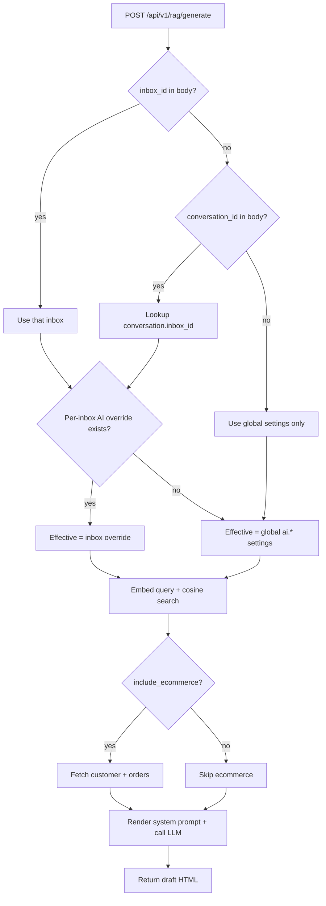

# RAG / Knowledge Base

HelperIQ ships a built-in RAG (Retrieval-Augmented Generation) pipeline
backed by `pgvector`. Knowledge sources are vectorised on a schedule, and
the agent-facing "Generate Response" button performs a cosine-similarity
search to find supporting context for an AI-drafted reply.

This page documents the REST surface for managing knowledge sources and
invoking generation.

| Method | Path | Permission |
| --- | --- | --- |
| `GET` | `/api/v1/rag/sources` | `ai:manage` |
| `GET` | `/api/v1/rag/sources/{id}` | `ai:manage` |
| `POST` | `/api/v1/rag/sources` | `ai:manage` |
| `PUT` | `/api/v1/rag/sources/{id}` | `ai:manage` |
| `DELETE` | `/api/v1/rag/sources/{id}` | `ai:manage` |
| `POST` | `/api/v1/rag/sources/{id}/sync` | `ai:manage` |
| `POST` | `/api/v1/rag/upload` | `ai:manage` |
| `POST` | `/api/v1/rag/search` | `ai:manage` |
| `POST` | `/api/v1/rag/generate` | `messages:write` |

## Source types

| `source_type` | What it stores | `config` shape |
| --- | --- | --- |
| `macro` | Reply macros (templates) — auto-imported from the macros table | `{}` |
| `webpage` | HTML pages crawled from a URL | `{ "url": "https://...", "crawl_depth": 2 }` |
| `custom` | Free-form text snippets pasted into the admin UI | `{ "snippets": ["...", "..."] }` |
| `file` | Uploaded documents (`.pdf`, `.txt`, `.md`, `.docx`) | `{ "uploads": [{ "filename": "...", "media_uuid": "..." }] }` |

The `source_type` is **immutable** after creation — different types use
incompatible `config` schemas. To change the type, delete and recreate
the source.

## List sources

```
GET /api/v1/rag/sources
```

Returns all configured knowledge sources, ordered by creation time.

**Response:**

```json
{
  "data": [
    {
      "id": 1,
      "name": "Public help articles",
      "source_type": "webpage",
      "config": { "url": "https://help.example.com", "crawl_depth": 2 },
      "enabled": true,
      "document_count": 184,
      "last_synced_at": "2026-05-13T20:00:00Z",
      "created_at": "2026-04-01T10:23:00Z",
      "updated_at": "2026-05-13T20:00:00Z"
    }
  ]
}
```

## Get one source

```
GET /api/v1/rag/sources/{id}
```

## Create a source

```
POST /api/v1/rag/sources
```

**Body:**

| Field | Type | Required | Notes |
| --- | --- | --- | --- |
| `name` | string | yes | Display name shown in admin UI. |
| `source_type` | string | yes | One of `macro`, `webpage`, `custom`, `file`. |
| `config` | object | yes | Shape depends on `source_type`. |
| `enabled` | bool | no | Defaults to `true`. Disabled sources are skipped during search. |

**Example — webpage:**

```http
POST /api/v1/rag/sources
Content-Type: application/json

{
  "name": "Public help articles",
  "source_type": "webpage",
  "config": {
    "url": "https://help.example.com",
    "crawl_depth": 2
  },
  "enabled": true
}
```

**Errors:**

- `400 InputError` — `name` empty, `source_type` not in the allowed set,
  or `config` missing required fields for the chosen type.

## Update a source

```
PUT /api/v1/rag/sources/{id}
```

Accepts `name`, `config`, `enabled`. `source_type` is rejected if present
(see note above).

## Delete a source

```
DELETE /api/v1/rag/sources/{id}
```

Cascades to all `rag_documents` rows for that source.

## Trigger a manual sync

```
POST /api/v1/rag/sources/{id}/sync
```

Enqueues a sync job. For `webpage` sources this re-crawls; for `custom`
and `file` it re-embeds; for `macro` it picks up newly-added macros.

Returns `202 Accepted` immediately — sync runs in the background. Watch
`last_synced_at` on the source row to know when it finishes, or check
`document_count` for the new total.

::: tip Scheduled sync
A background coordinator re-syncs all enabled sources every hour. The
manual endpoint is for "I just added 50 articles and want them indexed
now".
:::

## Upload a file for indexing

```
POST /api/v1/rag/upload
Content-Type: multipart/form-data
```

Used by the admin UI's "File" source type. Accepts `.pdf`, `.txt`, `.md`,
and `.docx`. Returns a `media_uuid` to add to the source's
`config.uploads` array.

**Form fields:**

| Field | Type | Required |
| --- | --- | --- |
| `file` | file | yes |

**Response:**

```json
{
  "data": {
    "media_uuid": "8c3d9e1f-…",
    "filename": "product-manual.pdf",
    "size": 524288
  }
}
```

## Semantic search

```
POST /api/v1/rag/search
```

The admin "Test Knowledge Base" endpoint. Returns the top-N most similar
documents for a query.

**Body:**

| Field | Type | Default | Description |
| --- | --- | --- | --- |
| `query` | string | — required | Natural-language query. |
| `limit` | int | `5` | Max documents to return. |
| `threshold` | float | `0.25` | Minimum cosine similarity (0-1). Lower = more permissive. |

**Response:**

```json
{
  "data": [
    {
      "id": 4321,
      "source_id": 1,
      "source_name": "Public help articles",
      "title": "Resetting your password",
      "content": "If you've forgotten your password…",
      "similarity": 0.812,
      "url": "https://help.example.com/password-reset"
    }
  ]
}
```

## Generate a reply

```
POST /api/v1/rag/generate
```

The agent-facing "Generate Response" button. Drafts an AI reply by:

1. Resolving the effective AI settings (per-inbox override if set,
   otherwise global).
2. Embedding the question and running a cosine search across
   `rag_documents`.
3. Splitting hits into context docs (factual) and macro docs (tone
   references).
4. Substituting into the system prompt and calling the AI provider
   (OpenAI / Claude / OpenRouter, per global settings).

::: info Failure mode
If the RAG search itself fails (empty knowledge base, pgvector
misconfigured), the request does **not** fail. It continues with empty
context and the LLM produces a generic reply. Search failures are
logged at error level for the admin to investigate.
:::

**Permission:** `messages:write` (any agent who can reply can generate).

**Body:**

| Field | Type | Required | Description |
| --- | --- | --- | --- |
| `conversation_id` | int | one of these | Use the conversation's most recent message as the customer question. |
| `customer_message` | string | one of these | Use this string verbatim as the customer question. |
| `inbox_id` | int | no | Explicit inbox to use for per-inbox AI settings. Defaults to the conversation's inbox. |
| `include_ecommerce` | bool | no | When `true`, fetches customer + recent orders + mentioned-order details from the configured ecommerce provider and injects them into the prompt. Default `false` — Magento/Maho lookups are slow and shouldn't run unless the agent asked. Powers the "+ Orders" reply-box button. |

**Example:**

```http
POST /api/v1/rag/generate
Content-Type: application/json

{
  "conversation_id": 4217,
  "include_ecommerce": true
}
```

**Response:**

```json
{
  "data": {
    "response": "<p>Hi Linda,</p><p>Thanks for reaching out…</p>",
    "context_documents": [
      { "source_name": "Public help articles", "title": "Resetting your password", "similarity": 0.81 }
    ],
    "macro_documents": [
      { "title": "Friendly opening", "similarity": 0.42 }
    ],
    "ecommerce_context_included": true
  }
}
```

The frontend inserts `response` into the reply editor as draft HTML; the
agent can edit or accept it before sending.

### Effective AI settings resolution



## Database schema (reference)

```sql
CREATE TABLE rag_sources (
    id            BIGSERIAL PRIMARY KEY,
    name          TEXT NOT NULL,
    source_type   TEXT NOT NULL CHECK (source_type IN ('macro', 'webpage', 'custom', 'file')),
    config        JSONB NOT NULL DEFAULT '{}',
    enabled       BOOLEAN NOT NULL DEFAULT TRUE,
    last_synced_at TIMESTAMPTZ,
    created_at    TIMESTAMPTZ NOT NULL DEFAULT now(),
    updated_at    TIMESTAMPTZ NOT NULL DEFAULT now()
);

CREATE TABLE rag_documents (
    id          BIGSERIAL PRIMARY KEY,
    source_id   BIGINT NOT NULL REFERENCES rag_sources(id) ON DELETE CASCADE,
    title       TEXT,
    content     TEXT NOT NULL,
    url         TEXT,
    embedding   vector(1536) NOT NULL,  -- OpenAI text-embedding-3-small
    created_at  TIMESTAMPTZ NOT NULL DEFAULT now()
);

CREATE INDEX ON rag_documents USING ivfflat (embedding vector_cosine_ops);
```

## Related

- [AI Settings](./ai-settings) — configure providers, default system
  prompt, and per-inbox overrides.
- [Ecommerce](./ecommerce) — connect a Maho/Magento 1 store so `+ Orders`
  has data to inject.
