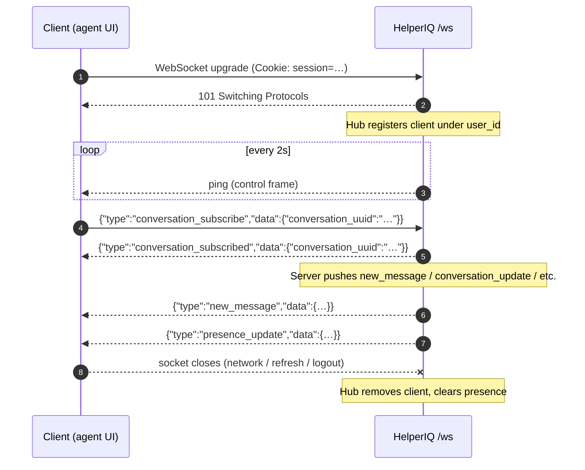

# WebSocket API

HelperIQ exposes a single agent-facing WebSocket endpoint that streams
real-time updates: new messages, conversation field changes, typing
indicators, presence, and notifications. The same connection accepts a
small number of **client → server** messages (subscription, typing,
viewing presence).

```
GET wss://your-helperiq-host/ws
```

Connection is gated by the same session cookie used for the REST API.

::: tip Widget WebSocket
There is a second WebSocket at `/widget/ws` used by the embedded live-chat
widget for anonymous visitors. It uses a different (anonymous) auth model
and is not documented here. This page covers the agent `/ws` endpoint
only.
:::

## Connection lifecycle



### Heartbeat

The server sends a **ping control frame** every **2 seconds**. Clients
should respond automatically (most WebSocket libraries do this for you).

Clients may also send the literal text `ping` and the server responds
with `pong` — this additionally **updates the user's `last_active_at`
timestamp** in the database. The agent UI uses this to keep presence
accurate while the tab is open.

### Authentication failures

If the session cookie is missing or invalid, the HTTP upgrade returns
`401 Unauthorized`. There is no in-band auth message; reconnect after
re-authenticating via `POST /api/v1/auth/login`.

### Reconnection

The connection is dropped on:

- Tab close / refresh
- Network drop
- Server restart

Clients should reconnect with exponential backoff (start at 1s, cap at
30s). On reconnect, **re-subscribe** to whatever conversation is
currently open and **re-emit `view_conversation`** to restore presence.

## Message frame format

All frames are **text frames** containing JSON. The shape is always:

```json
{
  "type": "<event_type>",
  "data": <event_specific_payload>
}
```

The one exception is the literal text `"ping"` (no JSON wrapping), which
the server replies to with literal `"pong"`.

## Client → server messages

| `type` | Purpose |
| --- | --- |
| `conversation_subscribe` | Subscribe to a conversation's real-time updates |
| `typing` | Broadcast typing indicator to the customer widget |
| `view_conversation` | Mark/unmark the agent as viewing a conversation (drives presence) |

### `conversation_subscribe`

Subscribes the client to messages and updates for a specific conversation.
A client can only be subscribed to **one** conversation at a time —
subscribing implicitly unsubscribes from any previous one.

**Send:**

```json
{
  "type": "conversation_subscribe",
  "data": {
    "conversation_uuid": "afa55a3b-60fa-4930-8382-4ad39cf6929f"
  }
}
```

**Server confirms with:**

```json
{
  "type": "conversation_subscribed",
  "data": {
    "conversation_uuid": "afa55a3b-60fa-4930-8382-4ad39cf6929f"
  }
}
```

::: info Authorisation
There is **no per-conversation authz check** on subscribe. All `/ws`
clients are authenticated agents (the endpoint is gated by `auth()`),
and the only data flowing over a subscription is typing indicators —
low value on their own. Enforcing per-frame access checks would add a
database lookup per keystroke and was deemed not worth the cost.
:::

### `typing`

Broadcasts the agent's typing status to the customer's widget. Private
notes are skipped (`is_private_message: true` is recorded but not relayed
to the customer).

```json
{
  "type": "typing",
  "data": {
    "conversation_uuid": "afa55a3b-60fa-4930-8382-4ad39cf6929f",
    "is_typing": true,
    "is_private_message": false
  }
}
```

| Field | Type | Description |
| --- | --- | --- |
| `conversation_uuid` | string | Required. Target conversation. |
| `is_typing` | bool | `true` when keystrokes are happening, `false` to clear. |
| `is_private_message` | bool | `true` when the agent is composing a private note (not relayed to customer). |

### `view_conversation`

Marks the agent as viewing a conversation. The server broadcasts a
`presence_update` to all agents so collision warnings ("Bob is also
viewing this") can be rendered.

**Start viewing:**

```json
{
  "type": "view_conversation",
  "data": { "conversation_uuid": "afa55a3b-60fa-4930-8382-4ad39cf6929f" }
}
```

**Stop viewing (e.g. agent navigates to inbox list):**

```json
{
  "type": "view_conversation",
  "data": { "conversation_uuid": "" }
}
```

An empty `conversation_uuid` clears the agent's presence on the previous
conversation. Presence is also cleared automatically when the WebSocket
connection closes.

## Server → client messages

| `type` | Trigger |
| --- | --- |
| `conversation_subscribed` | Confirmation of a `conversation_subscribe` |
| `new_message` | A new message has been added to a conversation |
| `message_update` | An existing message's status/content changed |
| `new_conversation` | A new conversation has been created |
| `conversation_update` | A conversation field (status, assignee, priority, tags, etc.) changed |
| `new_notification` | A user notification was created (mention, follower added, etc.) |
| `typing` | Another participant is typing (relayed from widget) |
| `presence_update` | The list of agents viewing a conversation changed |
| `error` | The server rejected a client message |

### `new_message`

Pushed when a message lands in a conversation the client is subscribed to,
or when the agent is the assignee/follower regardless of subscription.

```json
{
  "type": "new_message",
  "data": {
    "id": 12345,
    "uuid": "b29d68b1-2641-4e5d-b9e0-cf309e886727",
    "conversation_uuid": "afa55a3b-60fa-4930-8382-4ad39cf6929f",
    "type": "incoming",
    "status": "received",
    "private": false,
    "content_type": "html",
    "content": "<p>Hi, I have a question…</p>",
    "text_content": "Hi, I have a question…",
    "sender_id": 42,
    "sender_type": "contact",
    "created_at": "2026-05-13T21:47:44Z",
    "meta": {}
  }
}
```

### `message_update`

Pushed when an existing message changes state — typically the outgoing
status lifecycle:

```
pending → sending → sent
              ↓
            failed
```

```json
{
  "type": "message_update",
  "data": {
    "uuid": "b29d68b1-2641-4e5d-b9e0-cf309e886727",
    "status": "failed",
    "updated_at": "2026-05-13T21:47:46Z"
  }
}
```

The agent UI uses this to flip the message bubble's border red when a
send fails, and to show the "Failed: retry?" affordance.

### `new_conversation`

Pushed to agents who would see this conversation in one of their inbox
views (assigned to them, in a team they belong to, in an "all" view they
have permission for).

```json
{
  "type": "new_conversation",
  "data": {
    "uuid": "…",
    "reference_number": 217,
    "subject": "Login problem after password reset",
    "status": "Open",
    "priority": "Medium",
    "assigned_user_id": null,
    "assigned_team_id": 3,
    "inbox_id": 1,
    "contact": { "first_name": "Linda", "last_name": "Olsen", "email": "linda@example.com" },
    "last_message_at": "2026-05-13T21:47:44Z",
    "created_at": "2026-05-13T21:47:44Z"
  }
}
```

### `conversation_update`

Pushed when a conversation field changes. Partial payload — only changed
fields are included alongside the UUID.

```json
{
  "type": "conversation_update",
  "data": {
    "uuid": "afa55a3b-60fa-4930-8382-4ad39cf6929f",
    "status": "Resolved",
    "resolved_at": "2026-05-13T21:50:00Z"
  }
}
```

Common updated fields: `status`, `priority`, `assigned_user_id`,
`assigned_team_id`, `subject`, `tags`, `contact_id`, `last_reply_at`,
`waiting_since`, `contact_last_seen_at`.

### `new_notification`

Pushed when a user notification is created — agent mentions, follower
adds, assignment changes, etc.

```json
{
  "type": "new_notification",
  "data": {
    "id": 9876,
    "type": "mention",
    "title": "You were mentioned",
    "description": "Bob mentioned you in ticket #217",
    "conversation_uuid": "afa55a3b-60fa-4930-8382-4ad39cf6929f",
    "message_id": 12349,
    "read_at": null,
    "created_at": "2026-05-13T21:48:10Z"
  }
}
```

### `typing` (incoming)

Pushed when the customer is typing in the chat widget for a conversation
the client is subscribed to.

```json
{
  "type": "typing",
  "data": {
    "conversation_uuid": "…",
    "is_typing": true
  }
}
```

### `presence_update`

Pushed to **all** connected agents whenever the set of viewers for any
conversation changes (someone opens or closes a ticket).

```json
{
  "type": "presence_update",
  "data": {
    "conversation_uuid": "afa55a3b-60fa-4930-8382-4ad39cf6929f",
    "viewers": [
      { "user_id": 42, "first_name": "Bob" },
      { "user_id": 43, "first_name": "Alice" }
    ]
  }
}
```

::: warning Broadcast scope
`presence_update` is broadcast to **every connected agent client**, not
just clients viewing the affected conversation. Agents only need the
update for the conversation they're currently looking at, but the
server doesn't track that — clients should filter on
`conversation_uuid` against the conversation they have open.
:::

### `error`

Returned in response to a malformed or rejected client message.

```json
{
  "type": "error",
  "data": "invalid subscription format"
}
```

Possible `data` strings include:

- `"invalid message format"` — the JSON was unparseable.
- `"unknown message type"` — `type` field doesn't match any handler.
- `"invalid subscription data"` / `"invalid subscription format"` — the
  `conversation_subscribe` payload was malformed.
- `"conversation_uuid is required"` / `"conversation_uuid is required for typing"`
  — missing required field.
- `"invalid typing data"` / `"invalid typing format"`.
- `"invalid view_conversation data"` / `"invalid view_conversation format"`.

Errors are **non-fatal** — the connection stays open. Just fix the
client-side message and retry.

## End-to-end example (JavaScript)

```js
const ws = new WebSocket(`wss://${location.host}/ws`)

ws.addEventListener('open', () => {
  // Subscribe to the conversation we're currently viewing.
  ws.send(JSON.stringify({
    type: 'conversation_subscribe',
    data: { conversation_uuid: currentConversationUUID },
  }))
  // Mark ourselves as viewing for presence.
  ws.send(JSON.stringify({
    type: 'view_conversation',
    data: { conversation_uuid: currentConversationUUID },
  }))
})

ws.addEventListener('message', (event) => {
  const msg = JSON.parse(event.data)
  switch (msg.type) {
    case 'new_message':
      appendMessageToThread(msg.data)
      break
    case 'message_update':
      updateMessageStatus(msg.data)
      break
    case 'conversation_update':
      patchConversationFields(msg.data.uuid, msg.data)
      break
    case 'presence_update':
      if (msg.data.conversation_uuid === currentConversationUUID) {
        renderViewers(msg.data.viewers)
      }
      break
    case 'new_notification':
      pushNotificationToast(msg.data)
      break
    case 'error':
      console.warn('WS error from server:', msg.data)
      break
  }
})

// Typing indicator (debounced)
function onAgentKeystroke() {
  ws.send(JSON.stringify({
    type: 'typing',
    data: {
      conversation_uuid: currentConversationUUID,
      is_typing: true,
      is_private_message: isPrivateNoteMode,
    },
  }))
}

// On agent navigation away
function onLeaveConversation() {
  ws.send(JSON.stringify({
    type: 'view_conversation',
    data: { conversation_uuid: '' },
  }))
}
```

## Multi-tab / multi-device

A single user can have multiple `/ws` connections open simultaneously
(multiple tabs, mobile + desktop). The hub tracks them as separate
clients under the same user ID, and `BroadcastMessage` calls that target
a user fan out to every connection that user has open.

Presence is **per-client**, not per-user — if the same agent opens two
tabs on the same ticket, they appear as two viewers in `presence_update`.
The agent UI deduplicates by `user_id` before rendering.

## Implementation notes

- The server is a fasthttp WebSocket upgrader, on top of the
  [`fasthttp/websocket`](https://github.com/fasthttp/websocket) library.
- Each client has a buffered outbound channel (`Send chan WSMessage`).
  If the channel fills (slow consumer), the server logs and force-closes
  the client. The UI will reconnect automatically.
- Subscription state lives in-memory on the hub. A server restart
  invalidates all subscriptions — clients reconnect and re-subscribe.
- For horizontal scaling, the hub is **not** clustered across nodes.
  Multi-node deployments need a Redis pub-sub adapter (not yet
  implemented).

## Related

- [Followers](./rest/followers) for adding agents to a conversation
  so they receive `new_message` over WS without being assigned.
- [API Reference overview](./) for the full endpoint catalogue.
